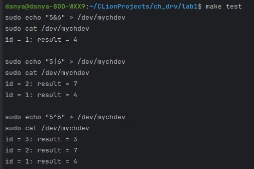

# Лабораторная работа 1

**Название:** "Разработка драйверов символьных устройств"

**Цель работы:**  научиться писать драйверы символьных устройств

## Описание функциональности драйвера

При записи в файл символьного устройства текста типа “5&6” должен запоминаться результат операции, то есть 4 для данного примера. Должны поддерживаться операции логического И, ИЛИ, исключающего ИЛИ. Последовательность полученных результатов с момента загрузки модуля ядра должна выводиться при чтении файла

## Инструкция по сборке
Этот драйвер собирается с версией ядра 6.2.0-36-generic и С99 или C11
* make install - скомпилировать проект и поставить его в ядро линукса

## Инструкция пользователя

* echo "5&6" > /dev/mychdev
* cat /dev/mychdev
  

## Примеры использования
* make clean - вынуть драйвер из ядра
* make test - загрузить тестовые данные
  